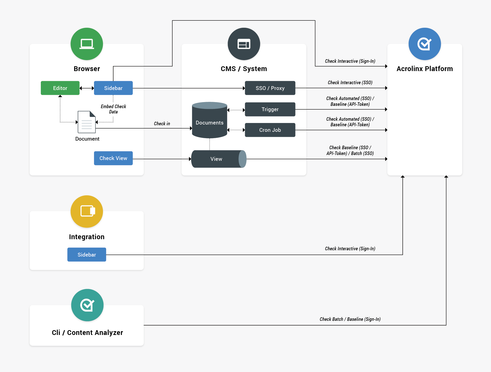

# Acrolinx Checking Features

Before you add Acrolinx to your application, you'll need to decide where and how to embed Acrolinx.

Acrolinx checks content in two ways:

* An automated check helps you automate your content creation workflow.
* The Sidebar gives writers an interactive user experience in the editor where they create content.

---
**NOTE**
How users [authenticate](configuration.md#Authentication) with Acrolinx informs the [check type](check-types.md).

---

## Sidebar - Interactive Direct

* Uses:
    + Simplest way to integrate Acrolinx.
    + Perfect for creating a proof of concept.
    + For writers checking content at creation time.
    + If the CMS can't connect to the Acrolinx Platform, the Sidebar might be your only option.
    + If the CMS is only available within your company's network and the Acrolinx Platform runs in the cloud.
* Connection:
    + Direct
    + Make sure that your web browser can reach the Acrolinx Platform.
* Authentication (no attention required on the integration side):
    + Acrolinx
    + External
    + Federated
* Administrator sets the [Acrolinx URL](configuration.md#Acrolinx-URL).

## Sidebar - Interactive SSO

* Uses:
    + Most convenient way and recommended for writers who use a Web CMS.
* Connection:
    + Use a reverse proxy on the CMS backend.
* Authentication:
    + SSO
* Set the [Acrolinx URL](configuration.md#Acrolinx-URL) on the CMS backend.

## Automated Check on an Event

* Uses:
    + Automatically check every document on update or save.
    + A suite of dashboards helps you assess performance, pinpoint problems, and improve your content operation.
* Connection:
    + CMS backend connects directly to the Acrolinx Platform.
    + Use one of the Acrolinx Platform SDKs.
* Authentication:
    + SSO: Use the signed in user or the last user who edited the content. Usually it's the same person. (recommended)
    + API token
* Set the [Acrolinx URL](configuration.md#Acrolinx-URL) on the CMS backend.
* Check type depends on the authentication:
    + Automated (recommended) for SSO
    + Baseline for API token

## Automated Check - Scheduled

* Uses:
    + It's not always feasible to automate a check on an event.
    + If you use an interactive integration option, you still might want to occasionally check your content as a whole.
    + Automatically check your content after updating terminology or guidelines.
    + A suite of dashboards helps you assess performance, pinpoint problems, and improve your content operation.
* Connection:
    + CMS backend connects directly to the Acrolinx Platform.
    + Use one of the Acrolinx Platform SDKs.
* Authentication:
    + SSO (recommended)
    + API token
* Set the [Acrolinx URL](configuration.md#Acrolinx-URL) on the CMS backend.
* Check type depends on the authentication:
    + Automated (recommended) for SSO
    + Baseline for API token

## View - Semiautomated

* Uses:
    + Check a batch of documents.
    + Create a dedicated Content Analysis Dashboard for a subset of content.
    + Manually check your content after updating terminology or guidelines.
* Connection:
    + CMS backend connects directly to the Acrolinx Platform.
    + Use one of the Acrolinx Platform SDKs.
* Authentication:
    + SSO (recommended)
    + API token
* Set the [Acrolinx URL](configuration.md#Acrolinx-URL) on the CMS backend.
* Check type depends on the authentication:
    + Baseline (recommended)
    + Batch - if the user that starts the check owns the content.

## Sidebar

* Uses:
    + Standard way of using Acrolinx in a standalone application.
    + Technically similar to [Interactive Direct (Sidebar)](#sidebar---interactive-direct).
* Connection:
    + Direct
    + Make sure that your integration can reach the Acrolinx Platform.
* Authentication (no attention required on the integration side):
    + Acrolinx
    + External
    + Federated
* Set the [Acrolinx URL](configuration.md#Acrolinx-URL) with an installer parameter or a deployed configuration.
    + Users normally enter the Acrolinx URL themselves.
* Check type is interactive.

Hint: The [Acrolinx Desktop Checker](https://docs.acrolinx.com/desktopchecker/latest/en) is an alternative to building
a full-featured integration.

## Batch

* Uses:
    + Check a set of documents at the same time.
    + An easy way of analyzing your content without coding.
    + Proof of concept.
* Connection:
    + Direct
    + Make sure that your integration can reach the Acrolinx Platform.
* Authentication:
    + Acrolinx
    + External
    + Federated
    + API token
* Users enter the [Acrolinx URL](configuration.md#Acrolinx-URL).
    + You can also set the Acrolinx URL with a script.
* Check type:
    + Batch (default) if the user owns the documents.
    + Baseline if checking other users' documents.

Instead of using an Acrolinx SDK, consider the [Acrolinx Command Line Interface](https://docs.acrolinx.com/cli/latest/en).
It's a highly scriptable solution designed for batch checking.
You can also use the [Content Analyzer](https://docs.acrolinx.com/ca/latest/en) to manually check a set of documents.
