# String Guidelines

## Sentence Case

### Labels

| Type                      | Example                        | Suggested Label Type |
| ------------------------- | ------------------------------ | -------------------- |
| Text field                | 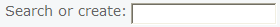 | LABEL.xxx            |
| Data in "statistics list" | 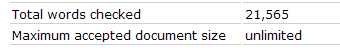 | LABEL.xxx            |
| Dropdown List items       | 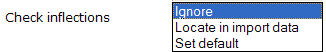 | LABEL.xxx            |
| Radio buttons             | 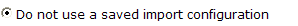 | LABEL.xxx            |
| Checkboxes                | 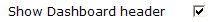 | LABEL.xxx            |

### Alerts, Messages, and Dialogs

(should be written with full stop and the end)

| Type                      | Example                        | Suggested Label Type |
| ------------------------- | ------------------------------ | -------------------- |
| Browser-generated prompt. | 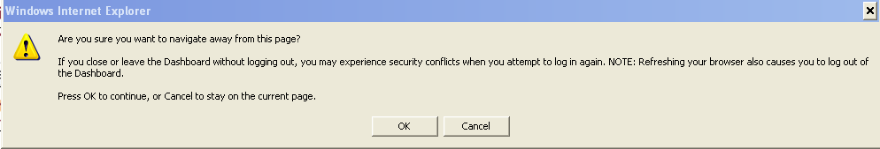 | MSG.xxx              |
| Prompt for decision       | 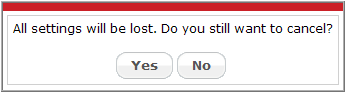 | MSG.xxx              |
| Input dialog              | 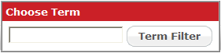 | MSG.xxx              |
| Warning                   | 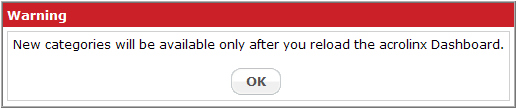 | MSG.xxx              |
| Empty table message       | 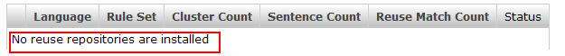 | MSG.xxx              |

## Title Case

### Buttons and Links

| Type                | Example                        | Suggested Label Type |
| ------------------- | ------------------------------ | -------------------- |
| Custom button       | 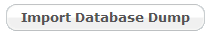 | BUTTON.xxx           |
| Windows button      | 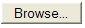 | BUTTON.xxx           |
| Small custom button | 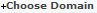 | BUTTON.xxx           |
| External link       | 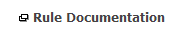 | BUTTON.xxx           |

### Menu Items and Navigation Elements

| Type            | Example                                                                                                                                                            | Suggested Label Type |
| --------------- | ------------------------------------------------------------------------------------------------------------------------------------------------------------------ | -------------------- |
| Horizontal menu | 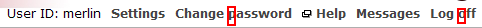                                                                                                                                     | MENU.ITEM.xxx        |
| Custom menus    | 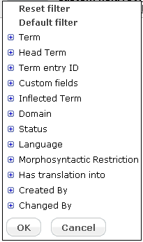 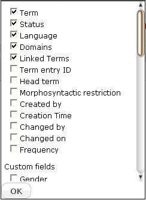 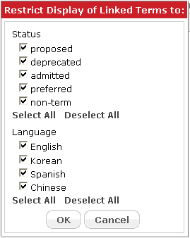 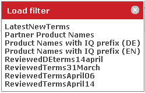 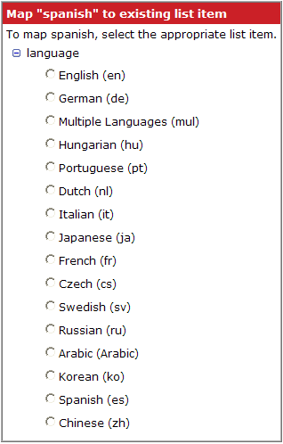 | MENU.ITEM.xxx        |
| Shortcut menus  | 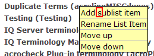                                                                                                                                     | MENU.ITEM.xxx        |
| Side-nav menu   | 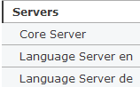                                                                                                                                     | MENU.ITEM.xxx        |
| Tab             | 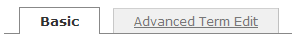 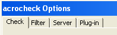                                                                                                      | TAB_NAME.xxx         |

### Titles and Headers

| Type                    | Example                        | Suggested Label Type |
| ----------------------- | ------------------------------ | -------------------- |
| Table column headers    | 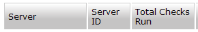 | TABLE_HEADER.xxxx    |
| Page header             |  | TITLE.xxx            |
| Section header type 1   | 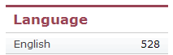 | TITLE.xxx            |
| Section header type 2   |  | TITLE.xxx            |
| Panel type 1            | 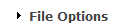 | TITLE.xxx            |
| Panel type 2            | 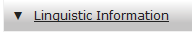 | TITLE.xxx            |
| Dialog and alert header |  | MSG_TITLE.xxx        |