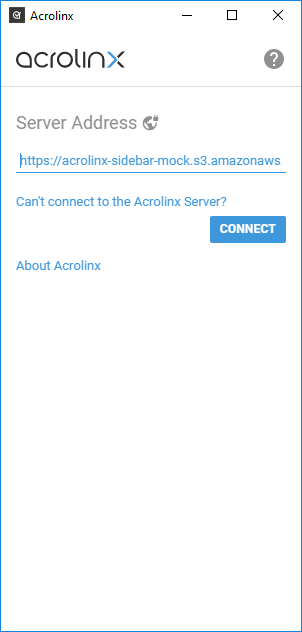
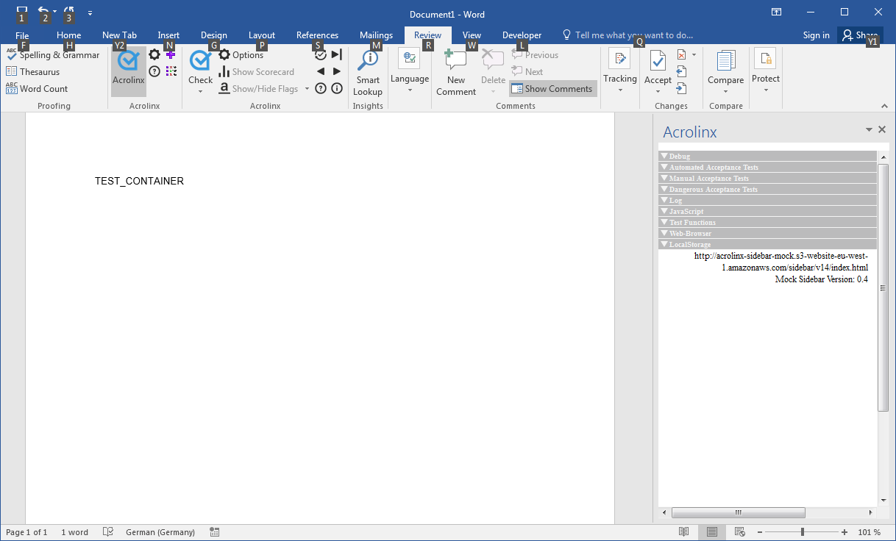
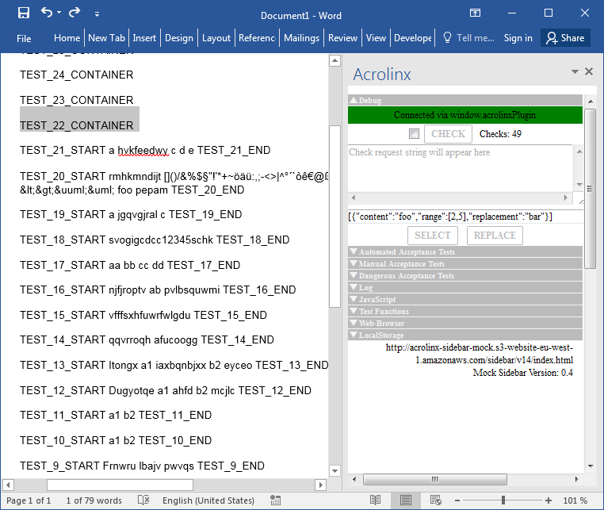
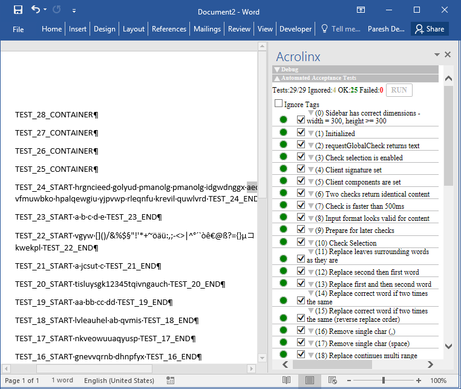
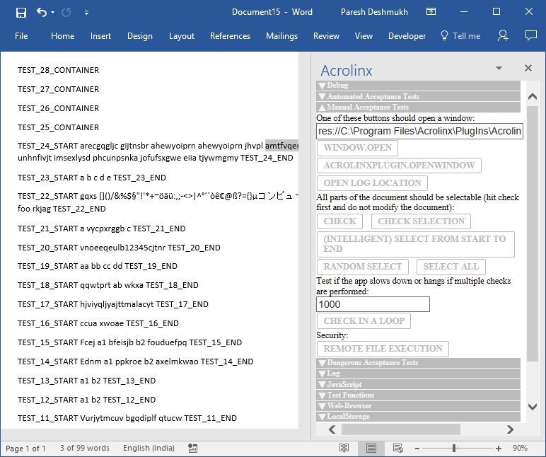
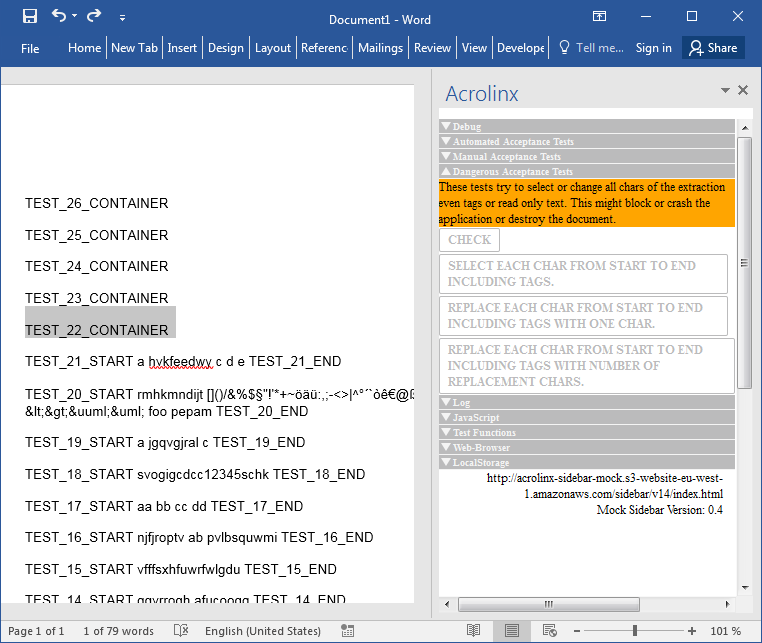
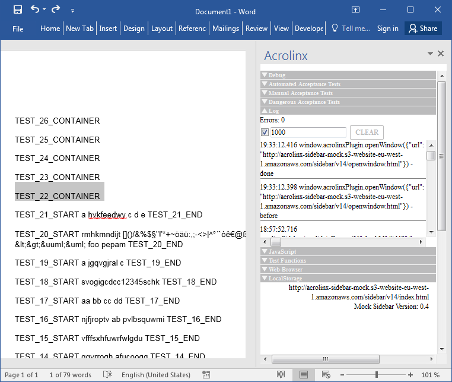
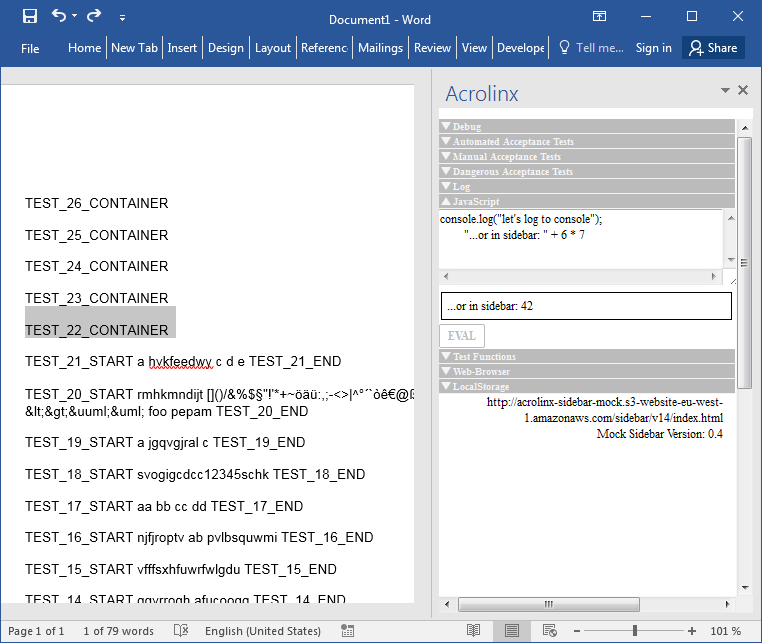
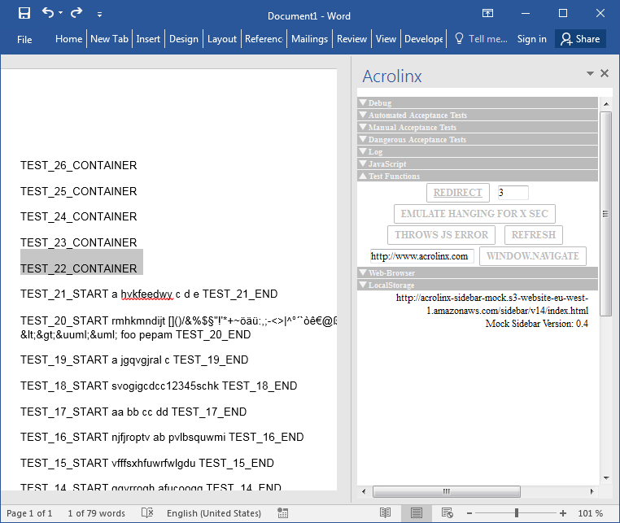
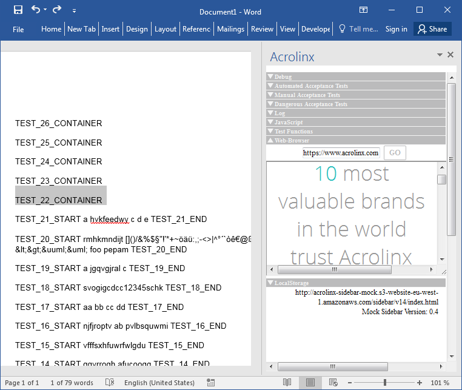

# Test Sidebar for Developers

## Connecting to the Test Sidebar

Enter the Test Sidebar URL as server address in the start page:

### Https (Recommended)

`https://acrolinx-sidebar-mock.s3.amazonaws.com`

### Http

`http://acrolinx-sidebar-mock.s3-website-eu-west-1.amazonaws.com/`

### Direct Reference

In some cases, it might be necessary to reference the Sidebar directly in code. That should be the exception.
In case you need to do, here is the URL:
`https://acrolinx-sidebar-mock.s3.amazonaws.com/sidebar/v14/index.html`

## Sections of the Test Sidebar

### Debug

In this section you can:

* See if the Acrolinx Integration has connected to the Sidebar.
* Check and see the extracted text in raw format (only if checkbox is switched on).
* Select text inside the text field and a JSON for selection and replacement is generated.
* Send the command for select or replace to the integration.

### Automated Acceptance Tests

To run the automated acceptance tests, you have to type `TEST_CONTAINER` somewhere into your text area of your application.
The `TEST_CONTAINER` must be inside of the text that is extracted. This `TEST_CONTAINER` is used for the later tests.
Most of the tests will operate inside this text area.
In one of the first tests, it'll be extended to TEST_Number_CONTAINER ... TEST_NumberOfTests_CONTAINER.
Each later test will perform its replacements inside its own TEST_X_CONTAINER variable.

You can click on the title of each test case to see the code of the test.
You can also click on the green or red dot to toggle the result sometime also a green test shows then a result.
For example, the test for the components (info dialog) shows what was set.

#### What Is Covered by the Tests

##### (0) Sidebar Has Correct Dimensions - Width = 300, Height >= 300 Width: 314, Height: 501

Test if size of container is correct.

##### (1) Initialized

Test if Sidebar was initialized correctly - if initialization is implemented wrongly,
it could vary the test becomes green depending on timing. If it's done correctly, the test should be green each time.

##### (2) `requestGlobalCheck` Returns Text

Test if at least something is returned if "check" button is pressed.

##### (3) Check Selection Is Enabled

Check if 'check selection' is enabled.

##### (4) Signature Set

Check if a signature is set.

##### (5) `ClientComponents` Are Set

Check if the components are set. Components are what you see in the about tab of the real Sidebar
See: [Acrolinx `clientComponent` Guidelines](initialization.md#clientComponents)

##### (6) Two Checks Return Identical Content

If that test fails, two checks without changing the text have different content.
A reason could be that the current time is included in the check request later checks could fail unexpectedly -
usually they shouldn't.

##### (7) Check Is Faster Than 500ms

Check if a simple text extraction is faster than 500ms.

##### (8) Input Format Looks Valid for Content

This test performs some rough tests. For example,
if the text starts with < and ends with > it assumes that the format might be XML or HTML.
If the format is HTML, it assumes that it finds at least one recognized HTML tag like div p or so.

##### (9) Prepare for Later Checks

This test is the first that changes the document.
It replaces the TEST_CONTAINER with the child container TEST_X_CONTAINER where X is the test number.
It also checks if this replacement succeeded.

##### (10) Check Selection

This test checks that the ranges of the selected content are correct.

##### (11) Replace Leaves Surrounding Words as They're

This test checks if a replacement doesn't replace text that is around the text that has been replaced.

##### (12) Replace second Then First Word

A simple replacement from end to start (simple because on second replacement the first offsets are still valid).

##### (13) Replace First and Then second Word

A simple replacement from start to end (harder because for the second replacement the offsets have changed).

##### (14) Replace Correct Word If Two Times the Same

Test if it takes the correct word, even if the word occurs two times.
This or the next test will fail if the integration uses a simple search for lookup.

##### (15) Replace Correct Word If Two Times the Same (Reverse Replace Order)

Same as before, but different order

##### (16) Remove Single Char `(,)`

Replaces a "," by ""

##### (17) Remove Single Char (Space)

Replaces a " " by ""

##### (18) Replace Continues Multirange

Replaces parts in a sentence like: `word1 word2 word3 word4` with `word1 replacement1 replacement2 word4`.

The replacement is done at once but with three ranges "word2" " " "word3"

##### (19) Replace Single Chars

This test replaces `word1 word2 word3 word4`
with `aa bb cc dd`.

The replacement is done each after each.

##### (20) Replace Inside a Word

The string `part1part2part3` is replaced by `part1replacement1part3`,
where the replaced range is only a part of the word (part2).

##### (21) Replace Discontinues Multirange

`word1 word2 word3` is replaced by
`replacement1 word2 replacement2`.
The replacement is done at once.

##### (22) Replace After Strange Chars Works

Strange symbols that might break extraction as well as offset calculation are inserted:
`/&%$§\"!'*+~öäü:,;-<>|^°´``òê€@ß?={}µコンピュータ&lt;&gt;&uuml;&uml;`.
Behind this string, replacements are done.

##### (23) Replace Same Word in Correct Order

The same word is inserted five times and replaced in an order:
`replace 1.`
`replace 5.`
`replace 3.`
`replace 4.`
`replace 2.`

##### (24) Select Words

This test just selects some words and tries if the lookup doesn't crash. We can't test if the lookup works.
We can test only, if it doesn't crash.

##### (25) One Pages Replacement and Check < 500msignored

(Turned off by default)

This test inserts one page of text and checks. It tests if the extraction can be performed faster than 500ms.

##### (26) 10 Pages Replacement and Check < 500msignored

(Turned off by default)

This test inserts 10 pages of text (will result in 11 pages) and checks.
It tests, if the extraction can be performed faster than 500ms.

##### (27) 100 Pages Replacement and Check < 500msignored

(Turned off by default)

This test inserts 100 pages of text (will result in 111 pages) and checks.
It tests, if the extraction can be performed faster than 500ms.

##### (28) `SelectRange` with Invalid Offsets Doesn't Crash the Application

(Turned off by default)

This test just sends some invalid offsets to select so that the integrator can ensure that the integration doesn't crash.

#### What the Automated Tests Don't Cover

The tests don't cover changes made manually by user.
If the integration tracks all actions the Sidebar does, then it can achieve 100%.
If the user changes one char by hand, all offsets are shifted.

If these tests succeed, it means that at least a user can perform all (test covered) Sidebar operations successfully.
If the user doesn't change the text by hand.
If the tests fail or some of them, some specific functionality won't work: see test result.

### Manual Acceptance Tests

This section provides some simple buttons for semiautomated testing.

#### WINDOW.OPEN and ACROLINXPLUGIN.OPENWINDOW

At least one of them should open a window.
In that window you should be able to hit the TESTJS button and get the message that JS Works.

#### Open Log Location

This test is intended for desktop application integration.
If this test succeeds, then it will open integration's log location.

#### (Intelligent) Select from Start to End

Should select the whole document from start to end. The tester should see, that the selection "runs" over the whole document.

This button tries to identify parts of the document in an "intelligent" way where the selection can be placed safely.

#### Random Select

Should select parts of the test randomly. That's for smoke testing.

#### Select All

All text should be selected. Depending on the host app, it could be possible that it isn't possible.
After running this test: you know ;-).

#### Acrolinx Storage

Checks if the integration supports Acrolinx storage.
The test verifies the Acrolinx storage by writing, fetching, and removing an item.

#### Check In a Loop

Extracts the text as many times as you specified.
You can use that function to watch the resources used by the application like memory.
If you want to stop, you've to quickly enter a `0` in the field ;-).

#### Remote File Execution Check

This is an important test to make sure that integration isn't allowing any unexpected executable to run under its privileges.
After click, if you observe new native processes (notepad, TextEdit, shell) in process monitor
then it's the time to revisit `acrolinxPlugin.openWindow` implementation.

### Dangerous Acceptance Tests

All other test didn't change the document or only changed the document inside the `TEST_CONTAINER` place holder.
These tests will change the whole document, crash the application or at least hang for a long time. Anyway they're useful.

#### Select Each Char from Start to End Including Tags

Does the same as intelligent select, but this time it starts at the beginning of the document.
It doesn't care if it's a useful selection. It just selects all chars each by each from start to end.
The tester should see the selection running from start to end.

#### Replace Each Char from Start to End Including Tags with One Char

Does the same as select but this time it replaces the char by number between 0 and 9. At the end,
the whole document should consist only of numbers and the application shouldn't be crashed ;-).

If the tester sees text that wasn't replaced then either the lookup or the replacement hasn't worked properly.

#### Replace Each Char from Start to End Including Tags with Number of Chars

Same as test before, but this time it replaces the chars by _number_ where number is a growing number for each replacement.
This test can be used to see if the replacements have been made in the correct order.

### Log

Shows all actions that had been performed from the Sidebar to the integration or the integration to the Sidebar.
Some of the log messages contain java script and can be clicked. The js code will appear in the JavaScript field.

### JavaScript

This filed can be used to execute any java script code.
You can try out new features in integration interface as well as rerun previous logged js commands.

### Test Functions

This section contains tests functions that might be useful for debugging some specific issues in the integration.

#### Redirect

Shows another page with a back button.

#### Emulate Hanging for X sec

Emulates how the integration and host application behaves if the js hangs for several seconds.
This can be used for testing if the host app redraws the dialogs or if the operating system tries to kill the app.

#### Throw JS Error

Throws a JS error. Can be used to test if it reaches the integration log or if the app crashes.

#### Refresh

Just refreshes the Sidebar page.
The integration should reconnect to the Sidebar (debug section or one of the integration tests).
Can be used while developing the Test Sidebar.

#### Window.Navigate

Can be used to just navigate to some other Sidebar or webpage within the Sidebar container.

### Web-Browser

Just some embedded kind of web browser (Iframe + address box).
This can be used to test if the browser control that has been used for the Sidebar supports some HTML / JS features
or CSS styles.

### LocalStorage

Show the browsers LocalStorage. All keys are displayed.
You have to click on each key to see the value. It can be used to see which information the "real" Sidebar stored.
It only works if both Sidebars are loaded from the same host.

### Without Title (Info)

Shows the current URL of the Test Sidebar and its version.
