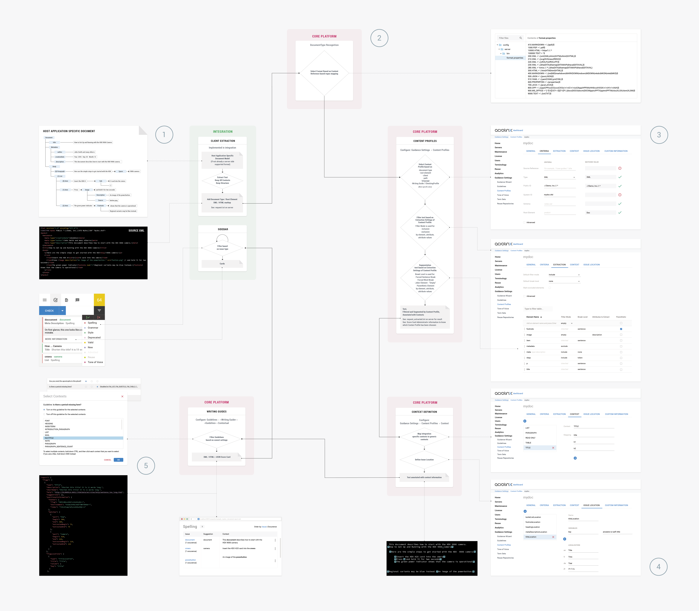

# Text Extraction

## How Acrolinx Reads Your Content

Before implementing the extraction, it makes sense to understand how Acrolinx reads your content.



The idea of this diagram is to provide a complete example starting at the extraction.
It demonstrates almost all feasible extraction settings.
Sorry, the diagram got a bit huge.
Try to zoom in and out and follow the lines and the numbers from 1 to 5.

## Check Format and Supporting Multiformat Editors

If the host application provides a format that is natively supported by Acrolinx, like:

* XML, or
* HTML format,
then you should send the entire content to the Acrolinx Platform.

The Acrolinx Platform supports different check formats natively:

| Format                    | API Setting  | Default Extension | Notes             |
| ------------------------- | ------------ | ----------------- | ----------------- |
| Text                      | `TEXT`       | `.txt`            |                   |
| XML                       | `XML`        | `.xml`            |                   |
| HTML                      | `HTML`       | `.html`           |                   |
| JSON                      | `JSON`       | `.json`           |                   |
| Java properties files     | `PROPERTIES` | `.properties`     |                   |
| Markdown                  | `MARKDOWN`   | `.md`             |                   |
| Java Source files         | `JAVA`       | `.java`           | Comments, Javadoc |
| Base64 encoded binary PDF | `PDF`        | `.pdf`            | no offsets        |

Check out the [supported input types documentation](https://docs.acrolinx.com/coreplatform/latest/en/compatibility/supported-input-types)
for a complete list.

The format for these types can be directly set when submitting a check using the API, or at the `sidebar.checkGlobal()` call.
It's also possible to set the format to `AUTO`.
In this case, the platform will decide the format based on a pattern matching the given reference.
Many formats, like DITA, or resx, are a subset of the supported formats with a different extension.

For multiformat editors, our recommendation is to let the Platform decide.
If we don't support the format yet, an upcoming platform release might make it work without any integration change.

*Note: A [mapping](https://docs.acrolinx.com/coreplatform/latest/en/advanced/core-platform-configurations/configure-acrolinx-to-recognize-your-file-type)
and a [Content Profile](https://docs.acrolinx.com/coreplatform/latest/en/guidance/content-profiles/get-started-with-content-profiles)
might be already in place. Otherwise you need to create one. The Acrolinx Solutions Team can help you create one.*

## Host Application API with Object Model

If the host application doesn't provide natively supported representation of the content,
then you must implement the text extraction as part of the Acrolinx Integration.

The extracted text should be as similar as possible to the object model and reflect what the user sees on the screen.
It would be nice to have a DTD or XML schema that defines the representation.

An extraction can look like this:

```xml
<?xml version="1.0" encoding="UTF-8" standalone="yes"?>
<!DOCTYPE integrationname PUBLIC "-//acrolinx integrationname-v1" "integrationname-v1.dtd">
<integrationname>
<page no="1">
    <p style="style1" language="en">some text</p>
    <table>
        <row>
            <cell language="en">some text in a table</cell>
        </row>
    </table>
    <somespecialelement>
    </somespecialelement>
    <group>
        <image />
        <textbox style="style2" language="en">some text</textbox>
        <textbox style="style3" visible="false" language="en">some other text</textbox>
        <textbox style="style3" visible="false" language="de">das ist ein test.</textbox>
    </group>
</page>
<page no="2" visible="false">

</page>
</integrationname>
```

The aim is to include all information that Acrolinx needs to analyze the content.

## What's Important for Text Processing

### Structure

The structure of the document:
If an element is inside another element or in a group of elements,
this structure should be represented in the converted document.
For an image, figure, or other nontextual element, you must create a placeholder with its type name.
Acrolinx doesn't need the actual image for text processing and
therefore you should send the image to the server with the document.

The order of the elements matters. The position of the elements `<text>This <image /> is nice</text>`
is different from `<text>This is nice</text><image />`.
The server can treat an image as a “joker” so that, for example,
Acrolinx won't falsely flag the guideline “use ‘this' with noun”.
Each element should include information about visibility (some content is hidden to the user), styles used, and so on.

Acrolinx relies on this structural and contextual information to know which parts of a document belong together.

#### Example

Depending on the structural information included with the content, a sentence like "This is a text." may be correct or incorrect:

Incorrect:

```html
<p>This is</p> <p>a text.</p>
```

Correct:

```html
<p>This is a text.</p>
```

It's important to maintain as much of the structure of the original document as possible.
Otherwise Acrolinx isn't able to detect this kind of issues.

### Contexts

The document needs to include information about the tags, styles, or, fonts in which a text span is written.
Acrolinx decides filtering, segmentation, and which guidelines to apply based on this contextual information.
The configuration can be done based on element names, attribute, or attribute values.

See: [Content Profiles Reference Guide](https://docs.acrolinx.com/coreplatform/latest/en/guidance/content-profiles/content-profiles-reference-guide)
    for a detailed description of the different filter and segmentation capabilities of Acrolinx.

#### Filter

It's feasible to filter (`exclude`) or explicitly `include` elements.

Further you can define elements as `empty`.
That means that they're filtered out, but Acrolinx assumes that the right word is at this place.
That's often the only choice if includes, or references can't be resolved.

#### Segmentation

Possible segmentations are:

* `none`, to ignore the context change,
* `token`, to treat it like a word boundary, or
* `sentence`, to have the same effect as a new paragraph would start.
* `prenthetic` elements will be checked individually and not in the context of where they are in the submitted text.

#### Read Only

It's also feasible to define contexts as `read-only`.
If a part of an issue is in a ready only area, then the corresponding Sidebar card will be read only too.
In case includes, references, locked, or write protected text is used in an integration, cards often need to be marked
read only.

#### Attributes

Attribute values can be extracted, but won't have full lookup support.

#### Example

Titles must be written in uppercase:

```xml
<title>Nice Title to Show how Relevant the Style Name is</title>
```

Normal text must be written in lowercase:

```html
<p>This normal text requires a dot at the end of the sentence.</p>
```

## Enable Acrolinx Providing Guidance and Analytics

1. Make sure that you send the file name, URI, or a unique reference to your source document.
   It helps Acrolinx to identify the document later.
   It'll also help Acrolinx users finding the content later inside the CMS, on the hard drive, or where ever it came from.
2. Set a DOCTYPE and/or root element so that Acrolinx is able to choose the right extraction.
3. Make sure that the recommended [check type](check-types.md) is used.

## What's a Document

Often it's unclear how much data should be included in one check request.
Acrolinx calculates scores for documents, provides guidance and reports to analytics.
For all of these cases, it's important to submit the right chunk of content.

Many CMS systems include several sources and generate one or more documents out of it.
For example, in DITA (XML) different topics are referenced in one map.
Based on this map one PDF manual or several web pages might be generated.
So the same content might be differently assembled.

* In case the published file is one document (for example PDF), the whole content should be submitted as one request.
* In case several web pages are created, each page should be checked and scored individually.

### Document Scope Hints

* The content has a unique reference.
* The reference is stable.
* The amount of data is exactly what gets published later on.
* All topics, or paragraphs of the content have the same target audience (group of readers).

## Check Selection

The Acrolinx Sidebar is capable of showing cards only for the text that was selected at check time.
The check selection feature can be enabled by setting the property `InitParameters.supported.checkSelection: true`.
While text extraction, the selected range offsets of the extracted text must be set using the property
`CheckOptions.selection.ranges:[[0,5], [400,500]]`.

To figure out the range offsets, a mapping between the application offsets and extraction offsets might have to be done.
This might be a reverse [implementation of the lookup](text-lookup.md).

*Note: If you use one of the Acrolinx SDK, then you might get the check selection feature more or less for free.*
*Check the SDK API for how to enable.*
